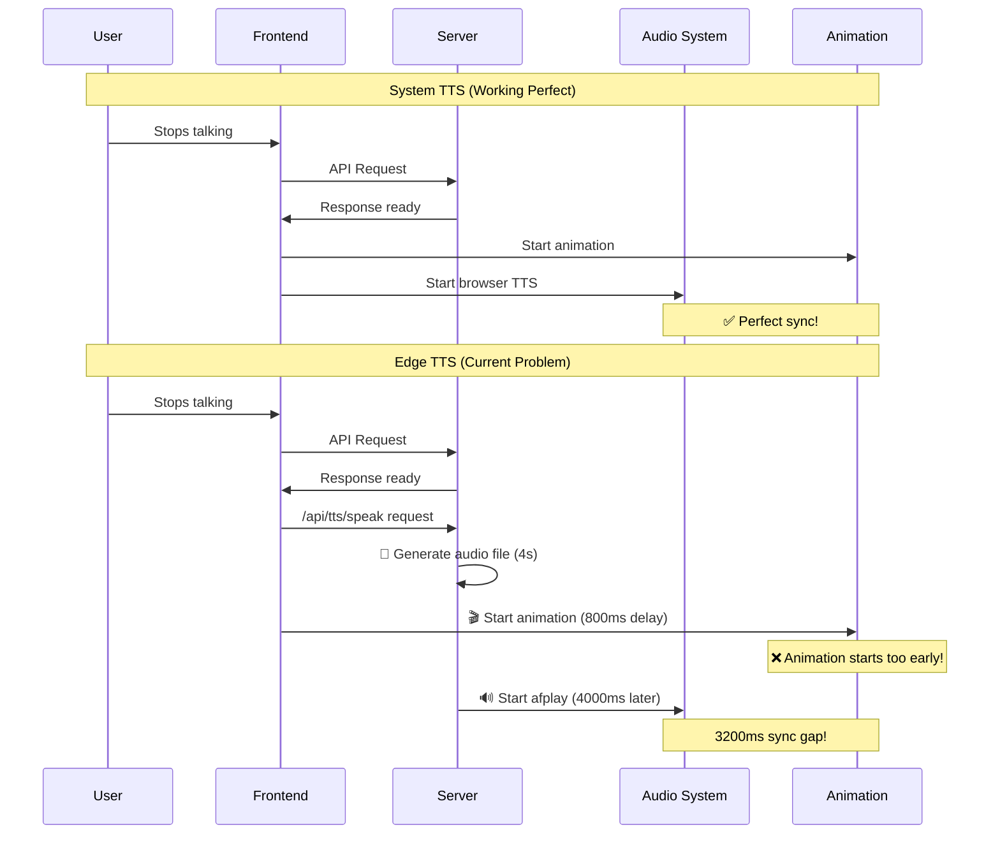
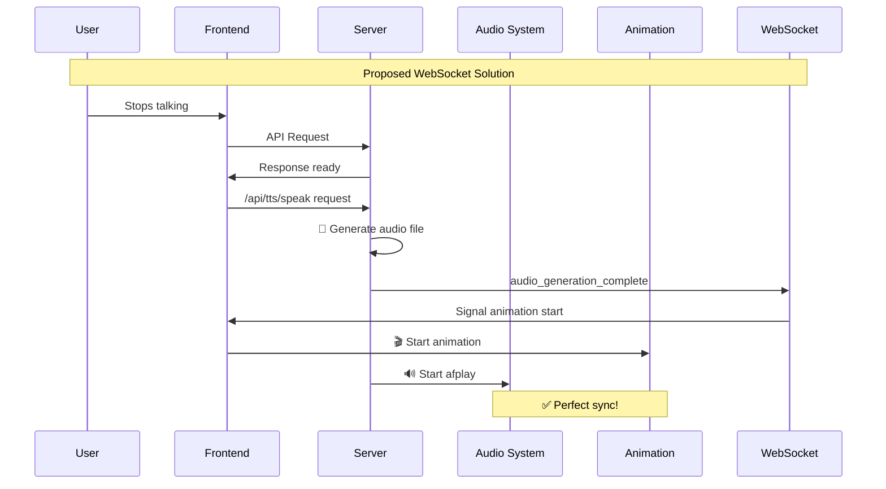

# Jarvis TTS Synchronization Flow Analysis

## Current Timing Issue - Mermaid Gantt Chart

```mermaid
gantt
    title Jarvis TTS Synchronization Timeline
    dateFormat X
    axisFormat %s

    section System TTS (Working)
    User stops talking        :0, 500
    API Response & Animation  :500, 600
    Browser TTS              :600, 5000
    Perfect Sync ✅          :500, 5000

    section Edge TTS (Problem)  
    User stops talking       :0, 1000
    API Response            :1000, 1000
    TTS Request sent        :1000, 1000
    🎤 File Generation      :1000, 5000
    🎬 Animation (TOO EARLY) :1800, 10300
    🔊 Audio Playback       :5000, 10000
    Sync Gap ❌             :1800, 5000
```

## Sequence Diagram

```mermaid
sequenceDiagram
    participant U as User
    participant F as Frontend  
    participant S as Server
    participant A as Audio System
    participant An as Animation

    Note over U,An: System TTS (Working Perfect)
    U->>F: Stops talking
    F->>S: API Request
    S->>F: Response ready
    F->>An: Start animation
    F->>A: Start browser TTS
    Note over A,An: ✅ Perfect sync!
    
    Note over U,An: Edge TTS (Current Problem)
    U->>F: Stops talking  
    F->>S: API Request
    S->>F: Response ready
    F->>S: /api/tts/speak request
    S->>S: 🎤 Generate audio file (4s)
    F->>An: 🎬 Start animation (800ms delay)
    Note over An: ❌ Animation starts too early!
    S->>A: 🔊 Start afplay (4000ms later)
    Note over A,An: 3200ms sync gap!
```

## Solution Flow

```mermaid
sequenceDiagram
    participant U as User
    participant F as Frontend  
    participant S as Server
    participant A as Audio System
    participant An as Animation
    participant WS as WebSocket

    Note over U,WS: Proposed WebSocket Solution
    U->>F: Stops talking  
    F->>S: API Request
    S->>F: Response ready
    F->>S: /api/tts/speak request
    S->>S: 🎤 Generate audio file
    S->>WS: audio_generation_complete
    WS->>F: Signal animation start
    F->>An: 🎬 Start animation
    S->>A: 🔊 Start afplay
    Note over A,An: ✅ Perfect sync!
```